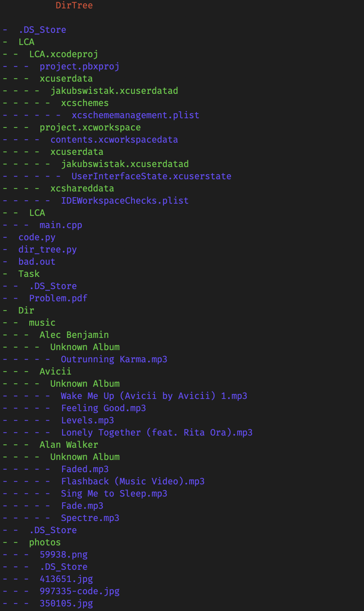

# Directory Tree 

Directory Tree is simple python programm which will help you to visualise your directories
## Getting Started

### Prerequisites

What things you need to install the software and how to install them

```
Give examples
```

### Installing


```
pip install termcolor
pip install colorama
```

To run script
```
python3 dir_tree.py
```

The output will look like image below.



